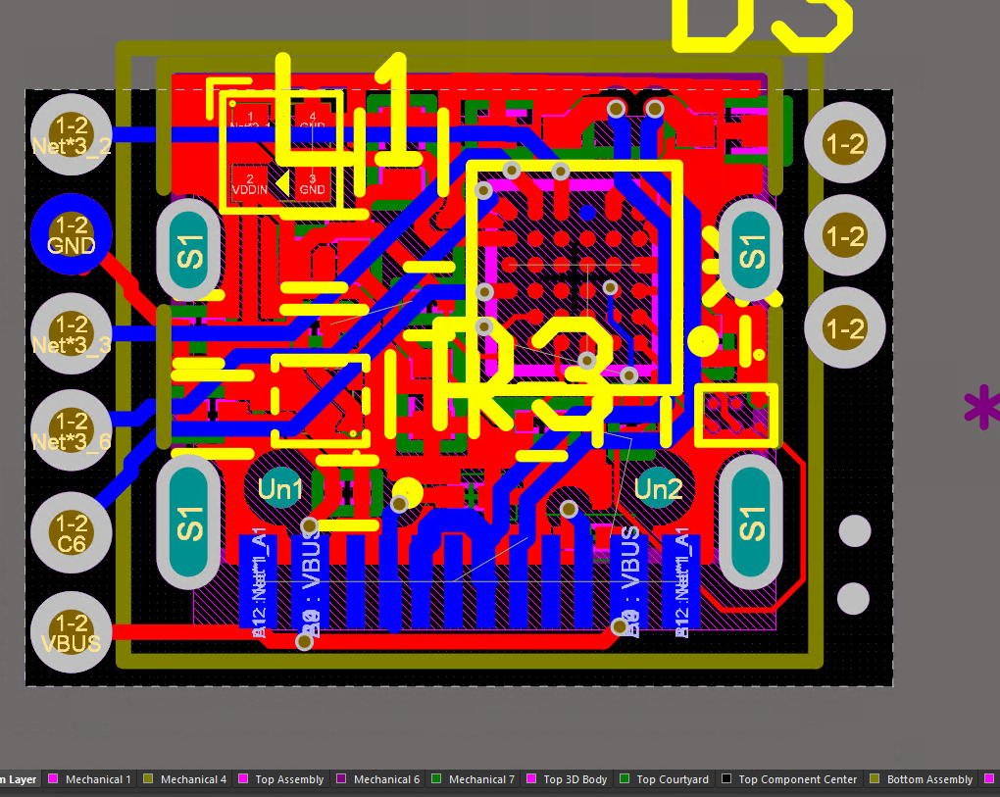
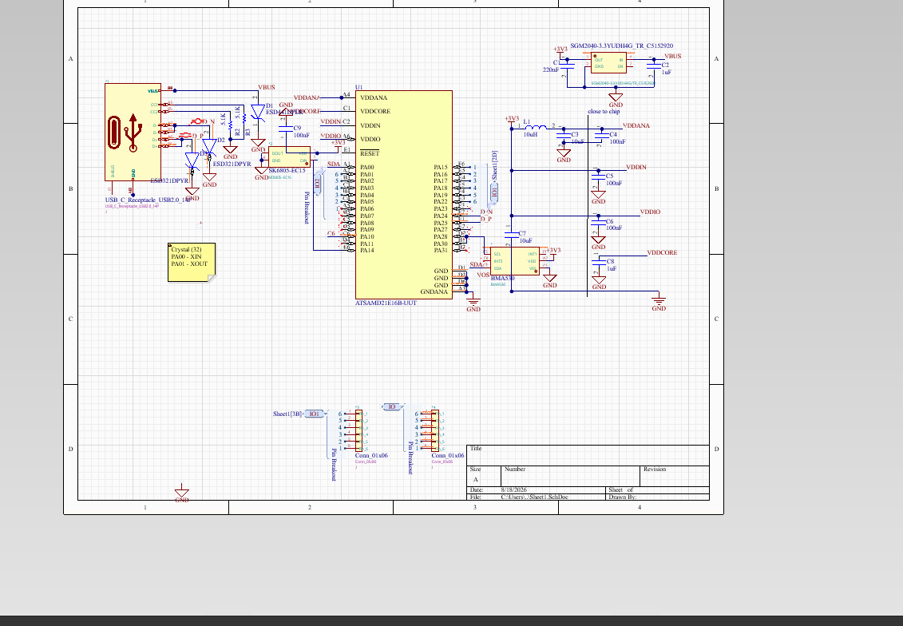

# tinySAMD
an atSAMD21 devboard aimed at size optimisation, without feature compromise
- 8 Pins
- Accelerometer + RGB LED
- USB-C
and just 9.2mm * 13 mm in total!

# Why did i make this?
- i wanted to do semi-hdi routing, which the 0.4mm pitch WLSCP35 package of the samd21 is perfect for
- i like making small things

# Setting Up
> this assumes you have openocd installed
- do NOT self-assemble, get it assembled first
- 
  - the pin at away from the USB-C is SWDIO
  - the other is SWCLK
- using a swd programmer, create a file called openocd.cfg with the following contents:
```
interface cmsis-dap

# Chip info 
set CHIPNAME at91samd21g18
source [find target/at91samdXX.cfg]

# samd21.cfg
source [find interface/cmsis-dap.cfg]

transport select swd

adapter speed 4000

source [find target/at91samdXX.cfg]

# optional: reset config
reset_config srst_only srst_nogate srst_open_drain
```

compile the [bootloader](https://github.com/microsoft/uf2-samdx1) and use ```openocd -f samd21.cfg -c "program firmware.elf verify reset exit"``` to flash it

# Usage
it's a devboard fuck around and find out

# (Sub)Links
- [Design Files](Source_Files/Design)
- [Production Files - Gerbers](Source_Files/Production)
- [BOM](BOM.csv)
- [Zine](Zine_tinySAMD.pdf)


# Images 
> sorry they suck altium is kinda ugly :(


